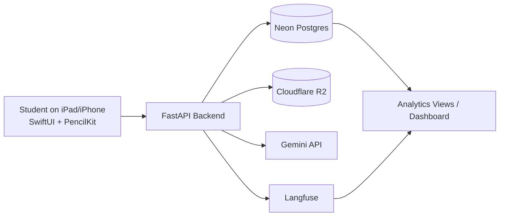

# Ratatoskur - Final Project Report (Draft)

This report follows the required final-project structure and documents the current final-state system.  
Two items are intentionally left as explicit placeholders for final polishing later:
1. Monitoring screenshots from current live traces/dashboard views.
2. One concrete incident write-up from recent production-like usage.

## 4.1 Problem & Users
Ratatoskur addresses a specific learning problem: students often get stuck while solving math problems on paper, but the support tools available to them are either too generic (full-solution calculators) or too rigid (static exercise books). In practice, many students need help that is contextual, step-aware, and available exactly at the moment they are working through their own handwritten solution. The core product goal is therefore not just to provide an answer, but to provide tutoring feedback that matches the student's current step, catches mistakes early, and preserves the student's own reasoning process.

Our primary target users are students who solve algebra and fraction problems by hand and want formative feedback while practicing. A secondary user group is teachers or mentors who need clearer visibility into recurring student errors and progress trends. Before using Ratatoskur, these users typically rely on a combination of class notes, manual checking, web calculators, and occasional teacher/peer help. That workflow is fragmented: it does not preserve step history well, and it provides little structured insight into repeated error patterns.

An AI/LLM-based approach is appropriate because the interaction is language- and context-heavy. The system needs to interpret imperfect handwritten input, reason about mathematical steps, decide feedback mode (`hint`, `check_solution`, `reveal`), and produce pedagogically useful explanations in Icelandic. This is a poor fit for rigid rule-only interfaces, but a strong fit for structured LLM orchestration with guardrails.

Our understanding of the problem evolved materially since Assignment 1. Initially, we framed the challenge mostly as "give useful hints from a student's handwritten solution." Through development and testing, we learned that the harder problem is reliability under real-world input quality and real-world user behavior. Students submit multi-page work, handwriting can be ambiguous, users move between pages and drafts mid-solution, and UX clarity around folders, image capture, and controls strongly affects whether AI feedback is even trusted. The final system reflects this broader framing: not only generating feedback, but supporting a dependable end-to-end learning workflow.

## 4.2 Technical Architecture
Ratatoskur is implemented as an iOS frontend with a Python backend and external model/storage services. The architecture intentionally separates interaction, orchestration, persistence, and observability concerns.

From a data-flow perspective, the primary path begins when a user creates or opens a problem and writes one or more handwritten pages. The frontend sends problem image data, solution pages, drawing payloads, selected mode, and context metadata to `/query`. The backend validates payload structure and limits, runs legibility and reasoning (or single-pass reasoning, depending on runtime settings), persists artifacts and attempt metadata, and returns structured feedback. Attempts, error events, and stage metrics are then available for analytics summaries, error-bank views, and personalized exam targeting.

A parallel flow exists for exam preparation. Users create an exam pack (auto-targeted from personal error history or manually targeted), start/resume sessions, answer items, and receive per-question or end-exam feedback depending on selected mode.

Technology choices were driven by iteration speed and reliability trade-offs. SwiftUI and PencilKit gave native handwriting support and fast UI iteration on iPad. FastAPI with SQLModel/Postgres gave a typed API layer and relational integrity for attempts, analytics events, error events, folders, and exam entities. Cloudflare R2 separated binary artifact storage from relational metadata. Gemini models provided multimodal reasoning with structured JSON output contracts, and Langfuse provided trace-level observability for debugging, latency, and cost awareness.

Prompt management is explicit and versioned in the backend prompt tree (`prompts/...`). We maintain prompt versions by capability family (modes, legibility, errors, exam generation/validation/grading). Runtime controls (`QUERY_PROMPT_VARIANT`, `QUERY_LEGIBILITY_PROMPT_VARIANT`, `QUERY_PIPELINE_MODE`, `expert_mode`) allow switching behavior without changing route logic. This was critical for controlled iteration from Assignment 3 to final.

## 4.3 LLM Integration & Prompt Strategy
The system uses Gemini models in a structured, task-routed way rather than a single monolithic prompt.

For main notebook reasoning, we use `gemini-3.1-flash-lite-preview` with JSON-schema constrained outputs (Pydantic-backed contracts). For deferred error classification and exam answer extraction, dedicated calls are used with task-specific schemas. The key design decision was to treat model responses as typed contracts, not free text, and reject malformed outputs.

The prompting techniques that worked best were structured outputs with explicit schema validation, mode-conditioned prompting (`hint`, `check_solution`, `reveal`) with strict behavioral boundaries, two-pass orchestration for uncertain handwriting (legibility first, reasoning second), taxonomy-guided outputs for error typing, and task-specific prompt families instead of a single universal prompt.

Prompt evolution from Assignment 3 to the final version followed a clear path. Early versions focused on baseline role instructions and output format. Later versions introduced stronger behavioral policies, few-shot grounding, stricter response consistency, and clearer unclear-input handling. Assignment 3 version notes show this progression and its effect on both accuracy and feasibility behavior, culminating in the v4 baseline that we carried forward into final-stage integration.

Several advanced patterns were implemented. First, a multi-turn clarification/confirmation loop allows the backend to return `confirm_reading` when handwriting is uncertain but interpretable, after which the user edits or approves interpreted text before grading proceeds. Second, pipeline routing allows configurable two-pass vs single-pass execution based on runtime settings. Third, expert-mode routing allows alternate prompt paths for stricter `check_solution` behavior without duplicating route logic. Fourth, deferred background analysis performs post-response error classification for analytics/error-bank updates without blocking immediate user response.

These patterns collectively improved controllability, debuggability, and user trust.

## 4.4 Evaluation & Quality Assurance
Evaluation builds directly on Assignment 3 methodology to preserve comparability. We keep the same 50-case labeled dataset (`assignment3.csv`) as the anchor benchmark and then validate behavior in full app-stack conditions.

Current quantitative reference points are the Assignment-3 selected baseline (v4) at **96.0% correctness** with **0 policy violations** over 50 cases, and the Assignment-4 app-stack subset (20 evaluated rows) at **95.0% verdict accuracy**, **0.0% non-feasible ratio**, and **1 mismatch** (case 48).

This indicates that policy behavior remained broadly stable when moving from isolated dataset evaluation into the full product system.

The key historical failure case was ambiguous handwriting (`id=48`), where earlier behavior could incorrectly proceed with confident interpretation. We now treat this class as a first-order safety problem. The implemented mitigation combines fail-closed legibility checks, confidence normalization, `confirm_reading` when interpretation is recoverable, and `ask_clarification` when it is not.

Quality assurance is layered across strict API-side input validation and upload constraints, typed output contracts with JSON/schema checks, bounded retry/backoff and explicit error surfacing, canonical error taxonomy normalization for analytic consistency, exam-specific validation for topics/modes/pack sizes and OCR input safety, auth/session checks with rotation semantics, and frontend preflight validation plus action-state constraints.

In short, the final system is no longer just "prompt and reply"; it is a guarded orchestration pipeline with explicit failure containment.

**Deferred refinement note:** if we run a fresh end-of-semester full evaluation pass on the same 50-case benchmark, we will replace numeric values while preserving this methodology and structure.

## 4.5 Deployment & Monitoring
The application is operated as a locally run system for the final course context (native iOS frontend launched from Xcode, backend service running locally, cloud database/storage services active). This deployment strategy was selected because public iOS deployment overhead is disproportionate for this course phase, while still allowing a live, end-to-end demo and real usage traces.

Monitoring combines platform-level and product-level telemetry. On the platform side, we track latency, token usage, cost estimates, mode/model metadata, and trace IDs. On the product side, we track attempt outcomes, error-event distributions, and feedback signals (including thumbs/comment paths) to connect technical behavior with user impact.

Evidence from prior observability runs includes an average latency around 24.823 seconds, p95 latency around 87.697 seconds, and tracked token usage with estimated cost from traced calls.

This monitoring layer is not only diagnostic; it informs product priorities. For example, user-testing feedback about perceived slowness directly matches latency/timeout patterns seen in traces and has been treated as an active optimization track rather than a one-off bug.

**To insert before final submission/presentation:**
- [TO ADD LATER] Monitoring screenshot 1 (trace detail view).
- [TO ADD LATER] Monitoring screenshot 2 (latency/tokens aggregate view).
- [TO ADD LATER] Monitoring screenshot 3 (quality/feedback trend view, if available).
- [TO ADD LATER] One concrete incident narrative (symptom, root cause hypothesis, mitigation).

## 4.6 Feature Plan Retrospective
In Assignment 6 we planned five core improvements. Looking back:

The first goal, user-based homepage statistics, was completed and expanded beyond a simple counter panel. We now show comparative weekly metrics, activity streak context, and mode-related behavior signals that support self-reflection.

The second goal, a user error bank, was also completed. Importantly, this became more than a static list: structured error extraction, normalized taxonomy, summary views, and detailed event views now form a coherent loop from mistake detection to user-visible reflection.

The third goal, latency reduction, is the one that is not fully complete. We improved reliability and degraded-mode behavior (validation, retries, safer unclear handling, and UX flow improvements), but user testing still shows response-time friction. We classify this as partially complete and still active.

The fourth goal, generating problems from user errors, was completed. Personal exam packs now target user error patterns automatically and also allow manual target selection. This is one of the most important shipped learning features from the final phase.

The fifth goal, anonymous data collection, is implemented on the backend foundation level (anon identifiers, consent fields, structured evaluation/dataset schema, analytics tracking). The remaining gap is UX exposure and communication of consent controls in the iOS surface.

We also added major features not originally in the A6 list, including one-level folder/subfolder organization with safer archive/delete behavior, extensive PDF workflow upgrades, full unclear-reading confirmation UX, substantial canvas/fullscreen/persistence stabilization, and stronger onboarding/profile clarity updates.

This retrospective shows that the roadmap was largely delivered, but also that usability and reliability discoveries during testing caused us to invest more heavily in interaction quality than initially forecast.

## 4.7 User Testing & Interaction Data
We conducted moderated testing with five external participants (non-group members), each completing a six-task scenario designed to cover the primary flow: account/folder setup, solving and iterating on problems, hint usage, error-bank inspection, and PDF submission creation/export.

All participants completed all tasks (30/30 total completions), which indicates that the system is operable end-to-end under guided testing. However, completion alone did not mean smooth UX. Timing patterns and think-aloud notes showed that the most time-consuming tasks were those involving multi-step problem solving and AI feedback waits.

SUS results were 72.5, 67.5, 95.0, 72.5, and 92.5 (mean 80.0, median 72.5), indicating above-average usability with noticeable friction clusters. Qualitative findings were consistent across users: folder hierarchy discoverability was confusing in earlier versions, latency/timeout behavior reduced trust in some flows, media/canvas control discoverability needed better affordances, and missing name capture during registration caused downstream PDF friction.

Interaction data also exposed unexpected behavior patterns: users often navigated to incorrect folder locations first, interpreted add-page actions differently than intended, and sometimes attempted camera capture flows that behaved inconsistently. These patterns informed concrete redesign work in folder IA, onboarding, media flow, and control placement.

The key point is that feedback did not remain descriptive; it was translated into shipped changes. We can now show a clear chain from user observation to product update.

## 4.8 Lessons Learned & Next Iteration
If we started over, we would front-load two areas much earlier: interaction architecture and failure-state design. Early project effort prioritized "can the model produce useful feedback?" That question mattered, but user testing showed that trust depends equally on how the app behaves when inputs are unclear, slow, or incomplete. In hindsight, legibility uncertainty, navigation clarity, and long-session writing ergonomics should have been treated as core product constraints from the beginning, not as late-stage polish.

For the next AI lifecycle iteration, we would expand data collection and iteration loops in three directions. First, we would deepen quality instrumentation for hint usefulness and failure categorization, so prompt changes can be evaluated with faster feedback cycles. Second, we would formalize privacy/consent UX so users can understand and control data usage directly in-app. Third, we would improve adaptive practice generation by incorporating richer temporal patterns (for example, recency-weighted errors and concept drift over time), not just aggregate historical frequency.

Our most important **technical** takeaway is that reliability in AI products comes from orchestration discipline: typed outputs, staged validation, explicit fallback paths, and traceable execution metadata. Our most important **non-technical** takeaway is that user trust is highly sensitive to interaction clarity. Even strong model behavior is undervalued when UI signals are ambiguous or latency feels unexplained. The strongest outcomes came when model design, product design, and user-testing feedback were treated as one integrated loop rather than separate tracks.

---

## Coverage Note
This draft explicitly covers every required written-report section (`4.1` through `4.8`) from the final project specification.  
Before submission, we only need to finalize the deferred monitoring evidence placeholders in `4.5` and optionally refresh final quantitative values in `4.4` if we run a new benchmark pass.
